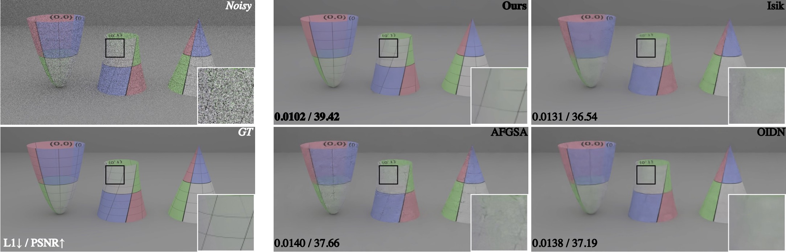

# Denoising Monte Carlo Renders with Diffusion Models

<p align="center">
  
</p>

Physically-based renderings contain Monte-Carlo noise, with variance that increases as the number of rays per pixel decreases. This noise, while zero-mean for good modern renderers, can have heavy tails (most notably, for scenes containing specular or refractive objects). Learned methods for restoring low fidelity renders are highly developed, because suppressing render noise means one can save compute and use fast renders with few rays per pixel. We demonstrate that a diffusion model can denoise low fidelity renders successfully. Furthermore, our method can be conditioned on a variety of natural render information, and this conditioning helps performance. Quantitative experiments show that our method is competitive with SOTA across a range of sampling rates. Qualitative examination of the reconstructions suggests that the image prior applied by a diffusion method strongly favors reconstructions that are like real images -- so have straight shadow boundaries, curved specularities and no fireflies.

Presented at *3DV 2025* [*Link to paper*](https://arxiv.org/abs/2404.00491)

## Building an Environment
- Please consult [*DeepFloyd IF*](https://github.com/deep-floyd/IF), from which this code heavily borrows.

## Dataset
- We show an example of loading the [*noisebase*](https://github.com/balintio/noisebase) dataset in this repo (11 channels - noisy, albedo, normals, depth, sample count map). Because our denoiser is single-frame only, we modified the noisebase dataloader to create batches of random frames from any sequence instead of the default video-style loading. Our method should train on just about any renderer's outputs. 


## Training and Inference
- We trained with batch size 12, which fit on a single A40 GPU. 
- **Training command:**

```shell
python run_dn.py  --logdir "logs/" --amp  --doCN --data_path /path/to/noisebase/data --num_workers=6
```
- To run **inference** add the `--eval` flag and set the `--model_load_path` to the path of a checkpoint. Use `--spp` to set the sample count of your test dataset.


## Citation
If you find this work helpful in your research, please consider citing our paper:

```shell
@misc{vavilala2024denoisingmontecarlorenders,
      title={Denoising Monte Carlo Renders with Diffusion Models}, 
      author={Vaibhav Vavilala and Rahul Vasanth and David Forsyth},
      year={2024},
      eprint={2404.00491},
      archivePrefix={arXiv},
      primaryClass={cs.CV},
      url={https://arxiv.org/abs/2404.00491}, 
}

